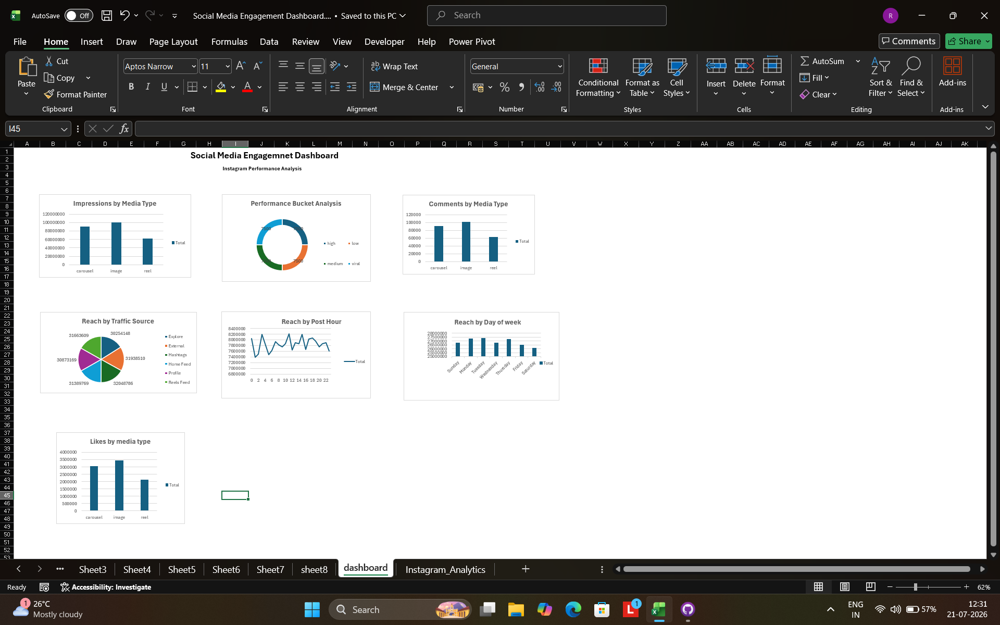
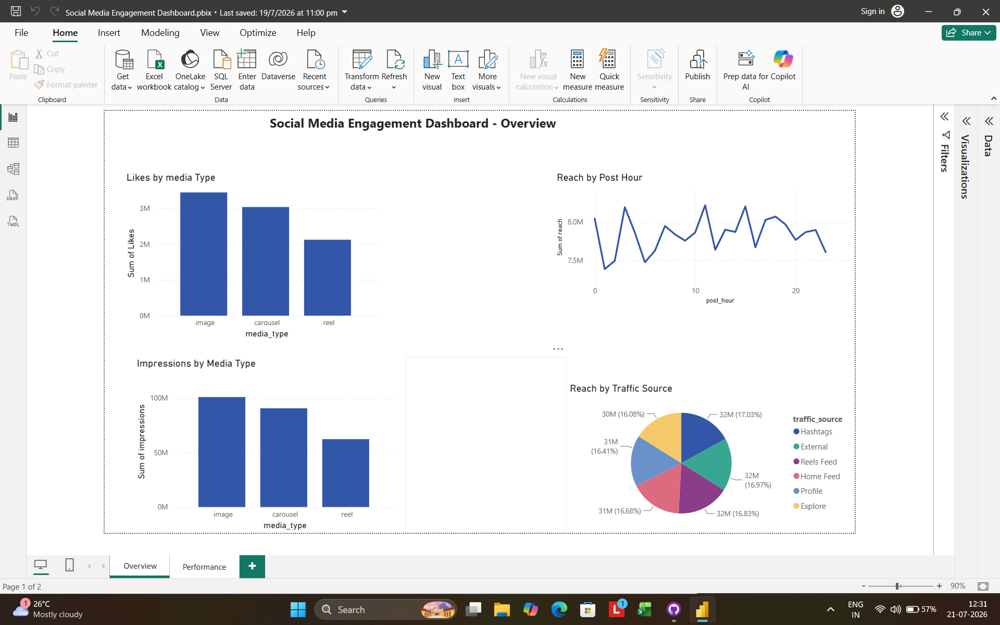
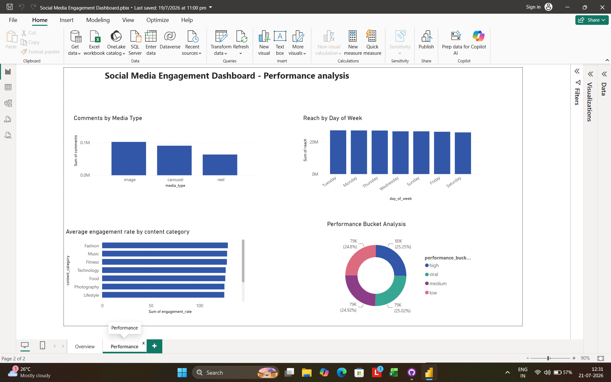

# Social Media Engagement Dashboard

## 📌 Goal
Track and analyze content engagement metrics across social media platforms to understand audience behavior and improve content strategy.

## 🛠 Tools Used
- Microsoft Excel
- Power BI

## 📊 What's Inside
This dashboard analyzes key social media engagement metrics including:
- **Likes, Shares, and Comments** across posts
- **Impressions and Reach**
- **Engagement rate trends over time**
- **Platform-wise performance comparison**

## 📈 Dashboard Views
1. **Excel Dashboard** – Summary tables and charts showing engagement breakdown  
   

2. **Power BI Overview** – Interactive visualization of overall engagement metrics  
   

3. **Power BI Performance View** – Detailed performance analysis by content type/date  
   

## 🔍 Key Insights
- Identified which content types (posts/reels/videos) drive the highest engagement
- Analyzed peak engagement time periods to recommend best posting times
- Compared performance trends to suggest content strategy improvements

## 📁 Files
- `Social Media Engagement Dashboard.xlsx` – Raw data and Excel-based analysis
- `Social Media Engagement Dashboard.pbix` – Power BI interactive dashboard file

## ✅ Outcome
Built a data-driven dashboard that helps identify top-performing content and optimal posting strategies based on engagement metrics.
